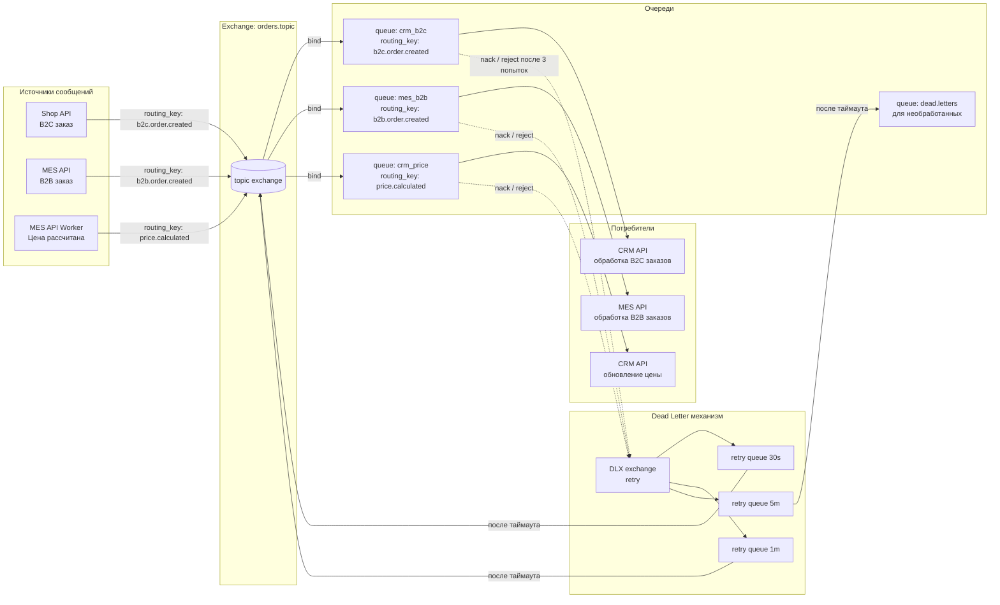
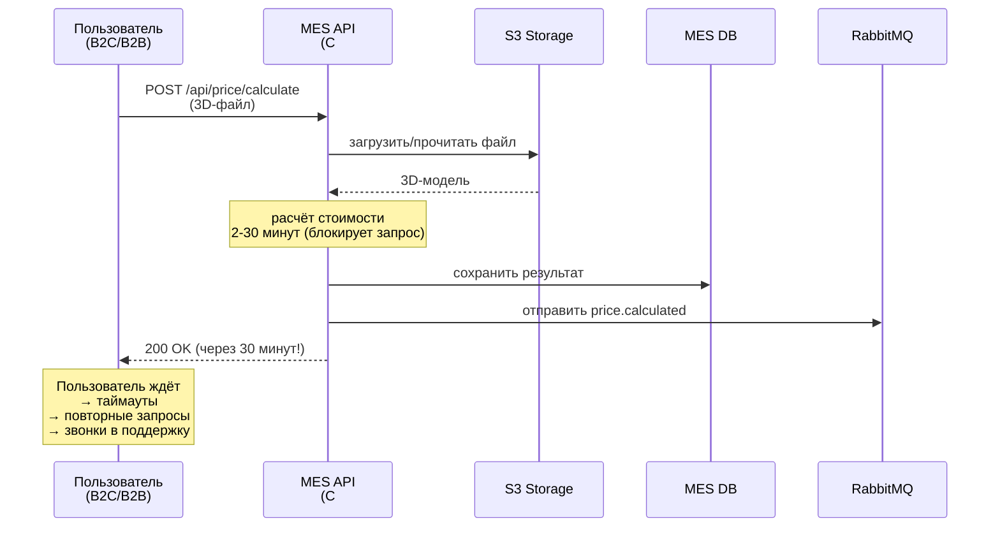
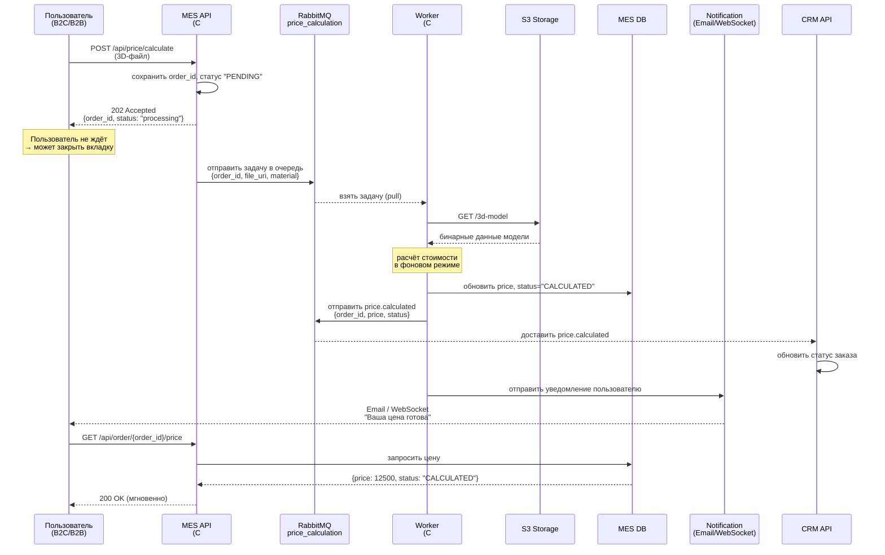

# 1. Контекст и ограничения

## Компания «Александрит»:
* B2C онлайн-магазин (Vue + Java Spring Boot)
* CRM для продавцов (Vue + Java)
* MES для операторов (React UI + C# API)
* Отдельное публичное API для B2B-партнёров (использует MES API)
* RabbitMQ для асинхронного обмена между CRM API и MES API
* Общее S3-хранилище для 3D-моделей
* Три окружения: dev, release, prod
## Ключевые ограничения:
* MES куплен с исходным кодом, но его расчёт стоимости — синхронный и блокирующий (2–30 минут)
* Найм активный, но нужно обоснование
# 2. Анализ проблем (по боли -> первопричина)
## Проблема 1: Критические задержки заказов (месяцы вместо 3 недель)
| Аспект | Описание |
|--------|----------|
| Симптомы | B2C и B2B клиенты жалуются, что заказов нет спустя месяцы |
| Гипотеза | RabbitMQ переполнен, сообщения теряются или не обрабатываются одним из consumer'ов |
| Первопричина (по схеме) | Два consumer'а в очереди RabbitMQ (CRM API и MES API). При высокой нагрузке один из них может падать или висеть → сообщения накапливаются. Нет мониторинга длины очереди. |
| Вклад MES | Долгий расчёт цены (30 мин) блокирует дальнейшие статусы, заказы накапливаются |
## Проблема 2: Долгая загрузка дашборда MES
| Аспект | Описание |
|--------|----------|
| Симптомы | Операторы жалуются, страница с фильтром и пагинацией всё равно тормозит |
| Гипотеза | MES API при каждом запросе делает тяжёлые JOIN/COUNT без индексов |
| Первопричина (по схеме) | MES UI → MES API → MES DB. В MES DB сотни тысяч записей. Фильтр + пагинация выполняют SELECT COUNT(*) и множественные подзапросы. |
## Проблема 3: Жалобы B2B-партнёров «не получили заказ»
| Аспект | Описание |
|--------|----------|
| Симптомы | API user создал заказ → статус в MES есть, но в CRM нет → партнёр не видит |
| Первопричина (по схеме) | B2B заказ идёт: API user → MES API → MES DB → (RabbitMQ) → CRM API. Если после отправки в RabbitMQ связь падает, CRM не получает уведомление. Нет dead-letter очереди и ретраев. |
| Дополнительно | MES API и CRM API не синхронизируют начальные статусы заказа (INITIATED, SUBMITTED) для B2B |
## Проблема 4: Потеря заказов из-за дубляции consumer'ов
| Аспект | Описание |
|--------|----------|
| Симптомы | Один заказ обработан MES API и CRM API одновременно → race condition |
| Первопричина (по схеме) | RabbitMQ — fanout или topic без эксклюзивных очередей на consumer'а. MES API и CRM API получают одно и то же сообщение. |
| Последствия | Двойная обработка, конфликт статусов, часть заказов застревает |
## Проблема 5: Задержки релизов
| Аспект | Описание |
|--------|----------|
| Симптомы | High/highest баги останавливают деплой до месяца |
| Первопричина | Только ручное E2E-тестирование QA. Нет автотестов на интеграцию через RabbitMQ и S3. |
# 3. Требования к решению (архитектурные)
| ID | Требование | Приоритет |
|----|------------|-----------|
| R1 | Обеспечить надёжную доставку сообщений между MES API и CRM API через RabbitMQ | Critical |
| R2 | Снизить время отклика дашборда MES до < 1 сек | High |
| R3 | Сделать расчёт цены асинхронным (не держать пользователя) | High |
| R4 | Разделить потоки B2C и B2B на уровне очередей | Medium |
| R5 | Внедрить автоматизированные интеграционные тесты для релизов | Medium |
| R6 | Организовать единую наблюдаемость (мониторинг, трейсинг, логи) | Critical |
# 4. Предлагаемые технические решения (маппинг на задания 2–5)
| Задача | Решение | Как закрывает проблемы |
|--------|---------|------------------------|
| Мониторинг (Task 2) | Prometheus + Grafana: длина очередей RabbitMQ, статусы консьюмеров, время расчёта цены, разница между MES DB и CRM DB | Проблемы 1, 3 |
| Трейсинг (Task 3) | OpenTelemetry + Jaeger: сквозной трейс от API user до CRM, включая S3 и RabbitMQ | Проблема 3, 4 |
| Логирование (Task 4) | ELK + структурированные JSON-логи с order_id, trace_id, consumer | Проблема 4, 3 |
| Кеширование (Task 5) | Redis: агрегаты дашборда MES (TTL=1 мин), результаты расчёта цены (TTL=30 мин), опционально метаданные 3D-моделей | Проблема 2 |
# 5. Архитектурные изменения (не только observability)
## 5.1 RabbitMQ: новая топология

## 5.2 Асинхронный расчёт цены
* Было: Пользователь ждёт 30 минут → таймаут → звонит в поддержку

* Стало:

* * Пользователь отправляет 3D-модель → получает 202 Accepted + order_id
* * MES API кладёт задачу в очередь price_calculation
* * Отдельный Worker (C#) считает цену, обновляет MES DB
* * MES API отправляет событие price.calculated в RabbitMQ → CRM обновляет статус
* * Пользователь получает уведомление (email / WebSocket) с ценой
## 5.3 Кеш дашборда MES (Redis)
| Ключ | Значение | TTL | Инвалидация |
|------|----------|-----|-------------|
| mes:dashboard:status:{status}:page:{page} | массив заказов | 1 мин | по событию изменения статуса |
| mes:stats:status_counts | {"NEW": 42, "IN_PROGRESS": 128} | обновляется инкрементом | при каждом изменении |
## 5.4 Интеграционные тесты (для CI/CD)
* Сценарии, которые должны проходить автотесты:
* * B2C: Shop API → Shop DB → S3 → (триггер) → MES API → RabbitMQ → CRM API
* * B2B: API user → MES API → MES DB → RabbitMQ → CRM API
* * Сбой: RabbitMQ недоступен → сообщение сохраняется в локальном outbox → доставляется позже
* * Dead Letter: необработанное сообщение после 3 попыток → попадает в очередь dead.letters → алерт
* Инструменты:
* * Testcontainers (RabbitMQ, PostgreSQL)
* * WireMock (S3)
## 6. План внедрения по спринтам
* Спринт 0 (текущий, до внедрения)
* * Развернуть Prometheus + RabbitMQ exporter (метрики очередей)
* * Добавить rate limiting на публичный MES API для B2B (не более 100 req/мин на клиента)
* Спринт 1 (2 недели)
* * Redis-кеш для дашборда MES API
* * Асинхронный расчёт цены (worker + очередь)
* * Метрики времени расчёта и длины очередей
* Спринт 2 (2 недели)
* * Новая топология RabbitMQ (разделение B2C/B2B, DLX)
* * OpenTelemetry в Java (CRM API, Shop API) и C# (MES API)
* * Интеграционные тесты в CI (testcontainer)
* Спринт 3 (2 недели)
* * ELK + структурированные логи
* * Дашборды в Grafana и Kibana
* * Тренинг команды по использованию observability
## 7. Найм и роли (обоснование)
| Роль | Кол-во | Зачем |
|------|--------|-------|
| Platform / SRE | 1 | Настройка Prometheus, Grafana, ELK, RabbitMQ топологии (поскольку текущий DevOps перегружен) |
| QA Automation | 1 (повысить текущего ручного QA) | Написание интеграционных тестов на Testcontainers; ускорение релизов |
| Backend C# | 1 | Доработка MES API (асинхронный расчёт, кеш, трейсинг) — текущий C# разработчик один, не справится |

Не нужны: отдельный фронтенд, дополнительный Java-разработчик (пока).
## 8. Риски и митигации
| Риск | Вероятность | Митигация |
|------|-------------|-----------|
| Переход на асинхронный расчёт цены ломает старые заказы | Средняя | Feature flag, переключение по типу клиента (B2C сначала старый синхронный, B2B — новый асинхронный) |
| Redis падает, и дашборд MES опять тормозит | Низкая | Fallback: прямой запрос в БД с таймаутом; реплика Redis |
| Команда не умеет работать с OpenTelemetry | Средняя | Воркшоп на полдня + docker-compose пример с Jaeger |
## 9. Бизнес-метрики успеха (через 1 месяц)
| Метрика | Целевое значение |
|---------|------------------|
| Время загрузки дашборда MES (p95) | < 1 сек (сейчас ~30 сек) |
| Доля заказов, зависших в статусе PRICE_CALCULATED > 1 часа | < 0.1% |
| B2B-партнёры, получившие заказ в CRM в течение 5 минут после API вызова | > 99% |
| Задержки релиза из-за E2E | 0 (все критич. пути покрыты автотестами) |
## 10. Предложенные изменения:
* Устраняют корневые причины (потеря сообщений, синхронные расчёты, неоптимальные запросы)
* Делают систему наблюдаемой (мониторинг, трейсинг, логи)
* Ускоряют релизы через автотесты
* Масштабируются на рост заказов (в 2–5 раз) без пересмотра архитектуры
