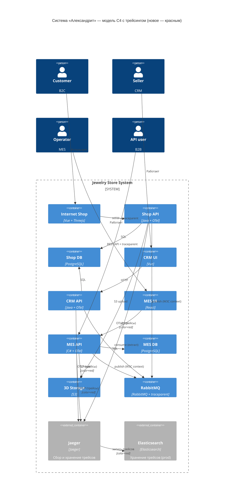
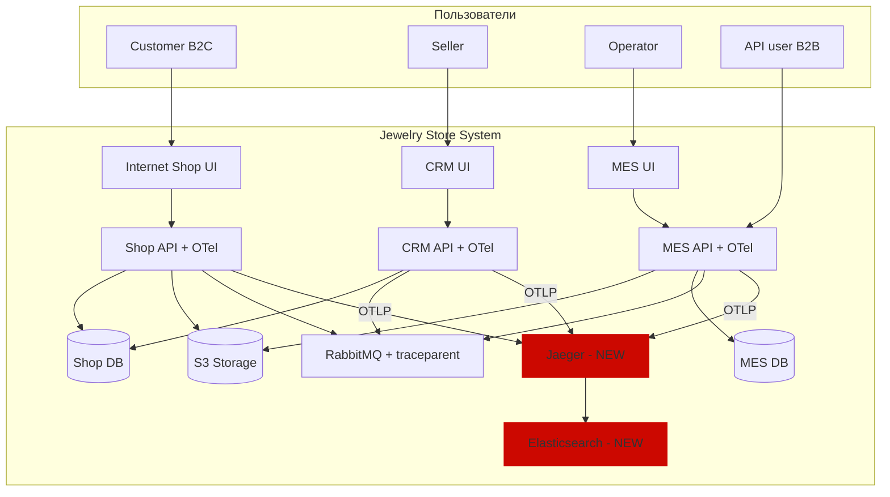
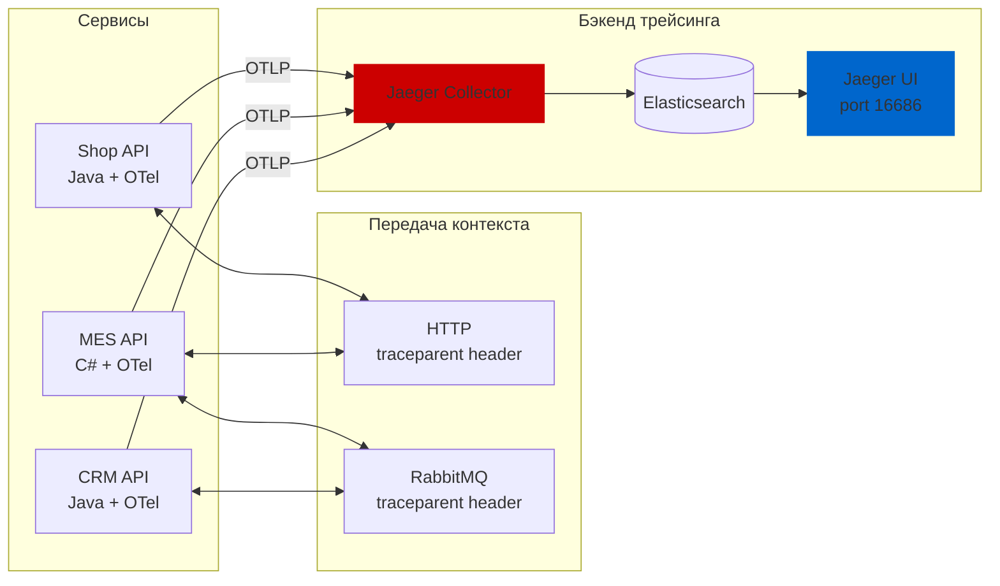
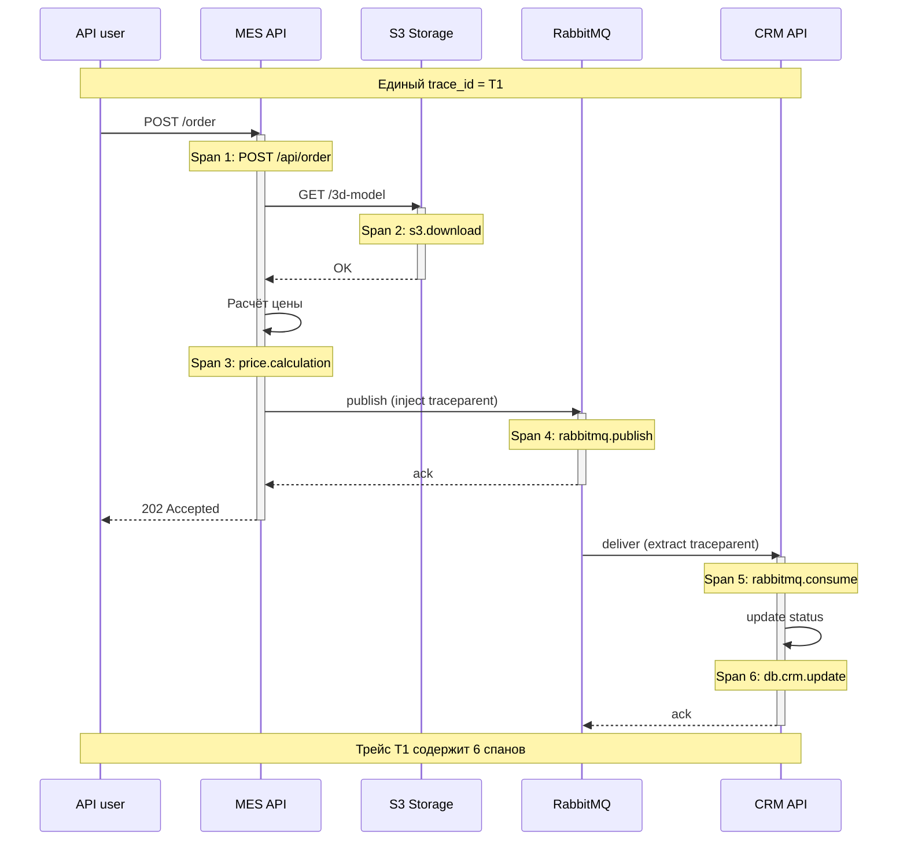
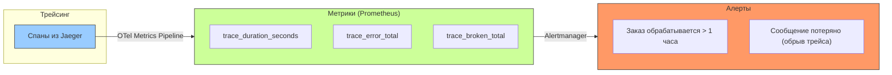
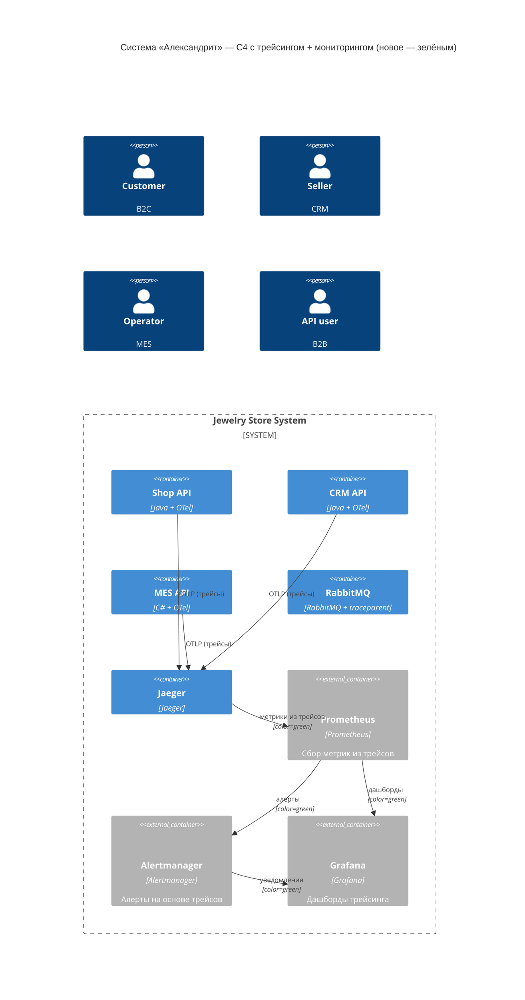
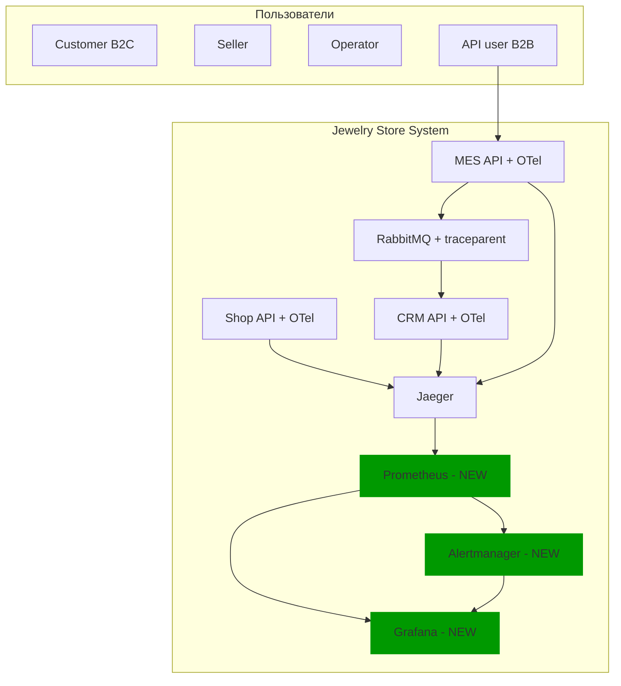
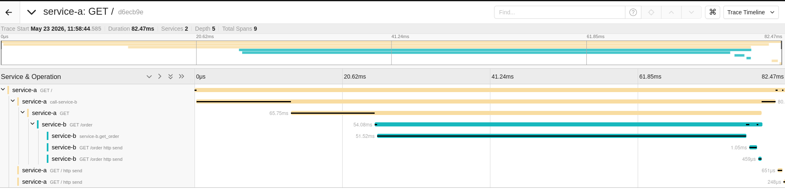

# 1. Анализ системы и выделение точек трейсинга
## 1.1 Где заказ может «сломаться» или зависнуть
| Этап | Где может сломаться | Причина |
|------|---------------------|---------|
| 1 | Shop API → S3 | Ошибка загрузки 3D-модели |
| 2 | Shop API → MES API | Синхронный вызов может упасть по таймауту |
| 3 | MES API → MES DB | Ошибка записи заказа |
| 4 | MES API → RabbitMQ | Сообщение потеряно при публикации |
| 5 | RabbitMQ → CRM API | Consumer не работает или падает |
| 6 | CRM API → CRM DB | Ошибка обновления статуса |
| 7 | B2B API user → MES API | Ошибка валидации, таймаут |
## 1.2 Системы, которые нужно покрыть трейсингом
| Система | Почему | Приоритет |
|---------|--------|-----------|
| Shop API | Первая точка входа B2C заказа | Critical |
| MES API | Расчёт цены, публикация в очередь | Critical |
| CRM API | Потребление сообщений, обновление статусов | Critical |
| RabbitMQ | Передача контекста между сервисами | Critical |
| S3 Storage | Чтение/запись 3D-моделей | High |
| Базы данных | Запись заказов, обновление статусов | High |
# 2. Список данных, которые должны попадать в трейсинг
## 2.1 Бизнес-данные (атрибуты спанов)
| Атрибут | Где используется | Зачем |
|---------|------------------|-------|
| order_id | Все сервисы | Связать трейс с конкретным заказом |
| client_id | MES API (B2B) | Идентифицировать партнёра |
| user_id | Shop API | Идентифицировать B2C клиента |
| status | CRM API | Отслеживать переходы статусов |
| polygon_count | MES API | Корреляция времени расчёта с моделью |
| file_size | Shop API, MES API | Корреляция с S3 latency |
## 2.2 Технические данные (атрибуты спанов)
| Атрибут | Зачем |
|---------|-------|
| http.method, http.route, http.status_code | Анализ API запросов |
| db.statement | Поиск медленных запросов |
| messaging.rabbitmq.queue | Идентификация очереди |
| s3.bucket, s3.key | Поиск проблем с файлами |
| error.type, error.message | Фиксация ошибок |
## 2.3 Контекст для связи сервисов
| Элемент | Формат | Передача |
|---------|--------|----------|
| trace_id | 32-байтовый hex | W3C Trace Context через HTTP header traceparent и RabbitMQ |
| span_id | 16-байтовый hex | Как часть traceparent |
| parent_id | 16-байтовый hex | Как часть traceparent |
# 3. Мотивация: зачем компании трейсинг
## 3.1 Текущая ситуация (боль)
* Заказы зависают в непонятном статусе, но никто не знает, на каком шаге
* Сообщения теряются в RabbitMQ, но инженеры узнают об этом через 2 дня от клиента
* Расследование одного инцидента занимает 3–6 часов ручного анализа логов
* B2B-партнёры теряют доверие из-за невозможности ответить на вопрос «где мой заказ?»
## 3.2 Что даст внедрение трейсинга
| Роль | Что получает |
|------|--------------|
| Инженер поддержки | Поиск заказа по order_id в Jaeger за 10 секунд |
| Разработчик | Визуализация узких мест (S3, БД, очередь) |
| Тимлид | Данные для приоритизации технического долга |
| Бизнес | Прозрачность: «заказ потерялся на шаге X, мы это починили» |
## 3.3 Метрики, на которые повлияет трейсинг
| Метрика | Тип | Целевое изменение |
|---------|-----|-------------------|
| MTTR (Mean Time To Resolve) | Техническая | с 6 часов → < 30 минут |
| Время поиска заказа по жалобе | Техническая | с 2 часов → < 1 минуты |
| Доля инцидентов с неизвестной причиной | Техническая | с 30% → < 5% |
| Удовлетворённость B2B-партнёров | Бизнес | +30% (NPS) |
| Потерянные заказы | Бизнес | с 2-3% → < 0.1% |
# 4. Предлагаемое решение
## 4.1 Выбор технологий
| Компонент | Технология | Обоснование |
|-----------|------------|-------------|
| Инструментирование | OpenTelemetry (OTel) | Стандарт, поддержка Java/C#, не привязан к вендору |
| Бэкенд трейсинга | Jaeger | Open source, интеграция с OTel, UI для поиска |
| Propagation через HTTP | W3C Trace Context (header traceparent) | Стандарт, поддерживается OTel |
| Propagation через RabbitMQ | W3C Trace Context в заголовках сообщений | Тот же стандарт, inject/extract через OTel |

Почему не Datadog APM: дорого, vendor lock-in, избыточно для MVP.
## 4.2 Какие компоненты нужно внедрить или доработать
| Компонент | Действие | Сложность |
|-----------|----------|-----------|
| Shop API (Java) | Добавить OTel Java Agent или SDK | Средняя |
| MES API (C#) | Добавить OTel .NET SDK, кастомные спаны | Средняя |
| CRM API (Java) | Добавить OTel Java Agent, @WithSpan | Средняя |
| RabbitMQ | Настроить inject/extract контекста | Низкая |
| Jaeger | Развернуть в k8s (уже есть конфиги) | Низкая |
| Elasticsearch | Для хранения трейсов в prod | Средняя |
## 4.3 Диаграмма контейнеров C4 с трейсингом

Более понятная схема

Архитектура трейсинга (компоненты и потоки)

Сквозной трейс (B2B заказ)

Структура трейса в Jaeger UI

```mermaid
flowchart LR
    subgraph Trace[Трейс: order_id = ORD-12345]
        Root[Span 1: POST /api/order - 5.2s]
        
        S2[Span 2: price.calculation - 4.8s]
        S3[Span 3: rabbitmq.publish - 50ms]
        
        S2_1[Span 2.1: s3.download - 4.5s]
        S2_2[Span 2.2: db.mes.insert - 200ms]
        
        S4[Span 4: rabbitmq.consume - 120ms]
        S4_1[Span 4.1: db.crm.update - 80ms]
    end

    Root --> S2
    Root --> S3
    
    S2 --> S2_1
    S2 --> S2_2
    
    S3 -.->|асинхронно| S4
    S4 --> S4_1

    style Root fill:#3b3616,stroke:#cc9900
    style S2 fill:#15173d,stroke:#0066cc
    style S3 fill:#15173d,stroke:#0066cc
    style S4 fill:#15173d,stroke:#0066cc
    style S2_1 fill:#003a04,stroke:#009900
    style S2_2 fill:#003a04,stroke:#009900
    style S4_1 fill:#003a04,stroke:#009900
```

# 5. Компромиссы (trade-offs)
## 5.1 Когда трейсинг не принесёт пользы
| Ситуация | Почему бесполезен |
|----------|-------------------|
| Проблема на стороне клиента (медленный интернет, старый браузер) | Трейсинг не видит клиентскую часть |
| Ошибка в проприетарной библиотеке расчёта цены | Нет исходников для добавления спанов |
| Проблема на уровне инфраструктуры (сгорел диск, отвалилась сеть) | Трейс оборвётся, но причина будет неясна |
| Заказ потерян до первого сервиса (клиент не нажал «Отправить») | Нет заказа — нет трейса |
## 5.2 Когда реализация слишком дорогая
| Ситуация | Почему дорого |
|----------|---------------|
| Проприетарная MES без исходного кода | Не можем добавить кастомные спаны (но у нас есть исходный код MES, повезло) |
| Старые версии RabbitMQ без поддержки заголовков | Нужно обновлять (риск, но не критично) |
| 100% сбор трейсов для всех запросов | Большой объём данных → дорогой Elasticsearch |
## 5.3 Сознательные упрощения
| Упрощение | Почему приняли | Что отложили |
|-----------|----------------|--------------|
| Sampling 10% для B2C | Экономия storage | Редкие ошибки B2C могут потеряться |
| Нет трейсинга фронтенда | Проблемы на бэкенде сейчас критичнее | Добавим OTel JS в спринте 4 |
| In-memory storage в dev | Быстрый старт, не нужен Elasticsearch | Трейсы теряются при рестарте |
# 6. Аспекты безопасности
## 6.1 Аутентификация и авторизация
| Доступ | Кто имеет право | Как реализовано |
|--------|-----------------|-----------------|
| Jaeger UI (просмотр трейсов) | Инженеры, поддержка, тимлид | OAuth2 через Yandex ID / Keycloak + роль tracing_viewer |
| Jaeger Query API | Только внутренние сервисы | mTLS внутри k8s |
| Elasticsearch | Только Jaeger Collector | Сетевые политики k8s (нет прямого доступа) |
## 6.2 Защита данных
| Риск | Митигация |
|------|-----------|
| Пользовательские данные в трейсах (order_id, user_id) | Не логируем PII (passport, phone). При необходимости — маскировка |
| Доступ извне компании | Jaeger UI не публикуется в интернет. Только через VPN или堡垒机 |
| Подмена traceparent злоумышленником | Клиентские заголовки не влияют на работу сервисов (только для отладки) |
## 6.3 Политики
```yaml
# Пример NetworkPolicy в k8s
apiVersion: networking.k8s.io/v1
kind: NetworkPolicy
metadata:
  name: jaeger-allow-only-otel
spec:
  podSelector:
    matchLabels:
      app: jaeger-collector
  ingress:
  - from:
    - podSelector:
        matchLabels:
          app: mes-api
    - podSelector:
        matchLabels:
          app: crm-api
    - podSelector:
        matchLabels:
          app: shop-api
    ports:
    - port: 4317  # OTLP gRPC
```
# 7. Дополнительное задание: автоматический мониторинг и алертинг на основе трейсинга
## 7.1 Как это работает
На основе данных трейсинга можно строить метрики и алерты, не дожидаясь жалоб клиента.

## 7.2 Метрики на основе трейсинга
| Метрика | Источник | Алерт |
|---------|----------|-------|
| trace_broken_total{reason="no_consumer"} | Трейс без завершающего спана | > 0 → critical |
| order_processing_duration_seconds (трейс) | Длительность от POST /api/order до CLOSED | p95 > 48 часов → warning |
| trace_error_total{service="crm_api"} | Спаны с error=true | > 10/час → warning |
## 7.3 Пример алерта на потерянное сообщение
```yaml
# Prometheus rule
- alert: TraceBrokenRabbitMQ
  expr: |
    (sum by (trace_id) (rabbitmq_publish_total) - 
     sum by (trace_id) (rabbitmq_consume_total)) > 0
  for: 5m
  labels:
    severity: critical
  annotations:
    summary: "Сообщение потеряно в RabbitMQ"
    description: "Трейс {{ $labels.trace_id }}: publish есть, consume нет"
```
## 7.4 Обновлённая диаграмма с мониторингом и алертингом

Более понятноеотображение

# 8. План внедрения
| Этап | Действие | Ответственный | Время |
|------|----------|---------------|-------|
| 0 | Развернуть Jaeger в k8s (конфиги уже есть) | DevOps | 1 день |
| 1 | Добавить OTel в MES API (C#): SDK, кастомные спаны, propagation в RabbitMQ | C# разработчик | 3 дня |
| 2 | Добавить OTel в CRM API и Shop API (Java) | Java разработчик | 3 дня |
| 3 | Настроить сбор трейсов в prod (Elasticsearch) | DevOps | 2 дня |
| 4 | Написать интеграционные тесты на propagation | QA | 1 день |
| 5 | Обучить команду (воркшоп 2 часа) | Тимлид | 0.5 дня |
| 6 | Развернуть Prometheus + Alertmanager для метрик из трейсов (доп. задание) | DevOps | 2 дня |

# Трейсинг с OpenTelemetry и Jaeger
## Service A (Python/FastAPI) — вызывает Service B
[service-a](service-a)
## Service B (Python/FastAPI) — возвращает статус заказа
[service-b](service-b)
## Конфигурация для Kubernetes
[k8s](k8s)
## Сборка и запуск
Локальная сборка образов (для Minikube или Kind):
* Собрать образы
```bash
cd service-a
docker build -t service-a:latest .

cd ../service-b
docker build -t service-b:latest .
```
* Если Minikube
```bash
minikube image load service-a:latest
minikube image load service-b:latest
```
### Запуск в Kubernetes:
* Применить конфигурации
```bash
kubectl apply -f k8s/jaeger.yaml
kubectl apply -f k8s/service-a.yaml
kubectl apply -f k8s/service-b.yaml
```
* Проверка, что всё запустилось
```bash
kubectl get pods
```
* Вызов service-a (должен вызвать service-b)
```bash
kubectl exec -it $(kubectl get pods -l app=service-a -o jsonpath='{.items[0].metadata.name}') -- python -c "import urllib.request; print(urllib.request.urlopen('http://service-a:8080').read().decode())"
{"message":"Service B responded","status_code":200,"response":"{\"order_id\":\"DEMO-12345\",\"status\":\"PROCESSING\",\"message\":\"Заказ в обработке\"}"}
```
* Открыть Jaeger UI
```bash
kubectl port-forward svc/jaeger 16686:16686
```
## Открыть в браузере: http://localhost:16686
## Пример скриншота
