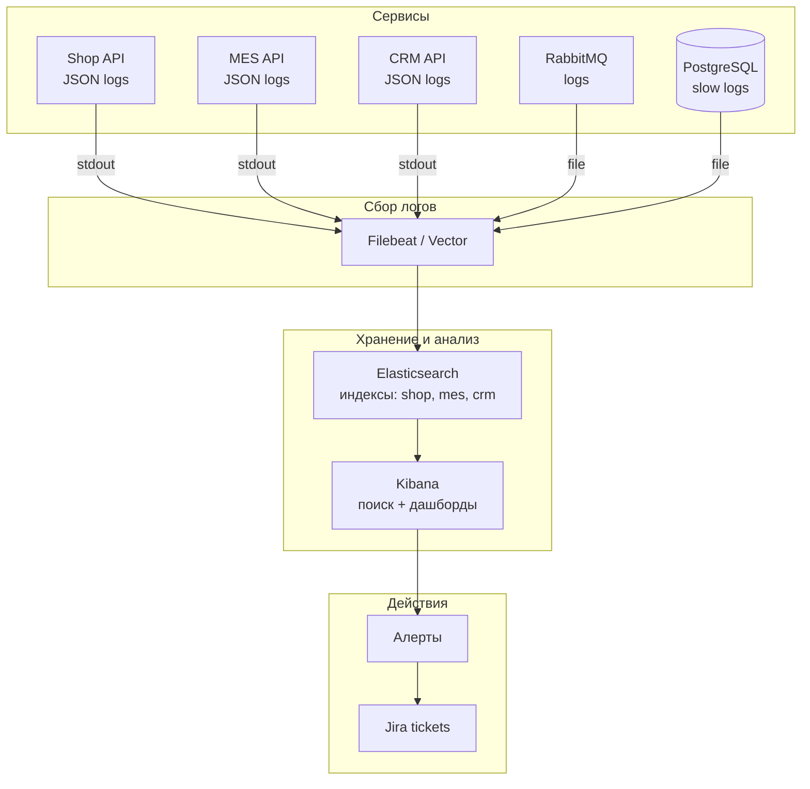

# 1. Анализ системы и C4-диаграммы в контексте логирования
## 1.1 Системы, требующие сбора логов
| Система | Почему | Приоритет |
|---------|--------|-----------|
| Shop API | Первая точка входа B2C заказов. Логи нужны для анализа ошибок при загрузке 3D-моделей и создании заказов | Critical |
| MES API | Расчёт цены (2-30 мин), публикация в RabbitMQ. Логи нужны для отслеживания долгих расчётов и ошибок публикации | Critical |
| CRM API | Потребление сообщений из очереди, обновление статусов. Логи нужны для выявления потерянных сообщений и ошибок обновления | Critical |
| RabbitMQ | Логи доставки сообщений (publish/consume/ack/nack) для отслеживания потерь | High |
| S3 Storage | Логи загрузки и чтения 3D-файлов для диагностики проблем с латентностью | High |
| Базы данных | Логи медленных запросов и ошибок подключения | Medium |
## 1.2 Необходимые логи с уровнем INFO
| Событие | Где логируется | Данные в логе |
|---------|----------------|---------------|
| Создание заказа | Shop API | timestamp, order_id, user_id, status=INITIATED, http_method, endpoint |
| Загрузка 3D-модели | Shop API | timestamp, order_id, file_size, polygon_count, file_format, upload_duration_ms |
| Отправка заказа | Shop API | timestamp, order_id, status=SUBMITTED, user_id |
| Запрос на расчёт цены | MES API | timestamp, order_id, client_id (для B2B), file_uri, material_type |
| Расчёт цены завершён | MES API (Worker) | timestamp, order_id, price, polygon_count, calculation_duration_ms, status=success/failed |
| Публикация в RabbitMQ | MES API | timestamp, order_id, queue_name, routing_key, message_id, status=published |
| Потребление из очереди | CRM API | timestamp, order_id, queue_name, message_id, status=consumed, consumer_tag |
| Обновление статуса заказа | CRM API | timestamp, order_id, old_status, new_status, seller_id (если есть) |
| Отправка заказа клиенту | MES API | timestamp, order_id, status=SHIPPED, tracking_number |
## 1.3 Уровни логирования (кроме INFO)
| Уровень | Когда использовать | Пример |
|---------|--------------------|--------|
| DEBUG | Разработка и отладка на dev-окружении. В prod — отключён | Детальный вход/выход из методов, параметры запросов |
| WARNING | Нештатная ситуация, но система восстановилась | Повторная попытка подключения к БД, ретрай RabbitMQ |
| ERROR | Ошибка, требующая вмешательства | Ошибка записи в БД, падение consumer'а, недоступность S3 |
| FATAL | Критическая ошибка, сервис не может работать | Сервис не может запуститься из-за конфигурации |
## 1.4 Приоритетность внедрения (логирование vs трейсинг)
Команда не может внедрить всё сразу. Первая очередь (спринт 1-2):

| Система | Логирование | Трейсинг | Почему сначала логирование |
|---------|-------------|----------|----------------------------|
| MES API | ✅ Приоритет 1 | ✅ Приоритет 2 | Логи расчёта цены критичны для ответа клиенту «почему так долго?» |
| CRM API | ✅ Приоритет 1 | ✅ Приоритет 2 | Логи consumer'а помогут понять, почему заказ не дошел |
| RabbitMQ | ✅ Приоритет 1 | ⚠️ Приоритет 3 | Логи publish/consume проще внедрить, чем propagation контекста |
| Shop API | ⚠️ Приоритет 2 | ⚠️ Приоритет 2 | Меньше проблем, но нужен базовый контроль |
| S3 | ⚠️ Приоритет 3 | ⚠️ Приоритет 3 | Проблемы S3 диагностируются через метрики |
# 2. Мотивация: зачем компании логирование
## 2.1 Текущая ситуация (боль)
* Ошибки и нестандартные ситуации разбираются со слов клиента: «что-то пошло не так»
* Разработчики и поддержка тратят часы на воспроизведение проблемы
* Нет единого места для поиска логов по order_id
* При инциденте приходится заходить на каждый сервер и смотреть логи вручную
* B2B-партнёры жалуются на долгие ответы поддержки

**Бизнес-результат: высокий MTTR, потерянные контракты, перегруженная поддержка.**
## 2.2 Что даст внедрение централизованного логирования
| Роль | Что получает |
|------|--------------|
| Поддержка | Поиск по order_id в Kibana за 10 секунд вместо 1 часа |
| Разработчик | Контекст ошибки (стек, параметры, статусы) без доступа к серверу |
| Тимлид | Анализ частоты ошибок по сервисам, приоритизация багов |
| Безопасность | Аудит доступа к заказам, выявление подозрительной активности |
| Бизнес | Прозрачность: по логам можно восстановить хронологию любого заказа |
## 2.3 Метрики, на которые повлияет логирование
| Метрика | Тип | Целевое изменение |
|---------|-----|-------------------|
| MTTR (Mean Time To Resolve) | Техническая | с 6 часов → < 30 минут |
| Время ответа поддержки | Техническая | с 2 часов → < 15 минут |
| Доля инцидентов, решённых без эскалации | Техническая | с 40% → < 80% |
| Удовлетворённость B2B-партнёров | Бизнес | +25% (NPS) |
| Число повторных обращений | Бизнес | снижение на 50% |
# 3. Предлагаемое решение
## 3.1 Выбор технологий
| Компонент | Технология | Обоснование |
|-----------|------------|-------------|
| Сбор логов | Filebeat / Vector | Лёгкий агент, поддержка Kubernetes, низкое потребление ресурсов |
| Транспорт | Kafka (опционально) или прямой в Elasticsearch | При росте нагрузки — буферизация |
| Хранение и поиск | Elasticsearch | Полнотекстовый поиск, агрегации, масштабирование |
| Визуализация | Kibana | Дашборды, поиск по order_id, алерты |
| Формат логов | JSON (структурированный) | Машинная обработка, фильтрация по полям |
**Почему не Loki + Grafana: Elasticsearch лучше подходит для сложных запросов и полнотекстового поиска по order_id.**
## 3.2 Какие компоненты нужно внедрить или доработать
| Компонент | Действие | Сложность |
|-----------|----------|-----------|
| MES API (C#) | Перейти на структурированное логирование (Serilog), добавить order_id, trace_id | Низкая |
| CRM API (Java) | Перейти на структурированное логирование (Logback + JSON), добавить order_id | Низкая |
| Shop API (Java) | Аналогично CRM API | Низкая |
| ELK Stack | Развернуть Elasticsearch, Kibana, Filebeat в k8s | Средня |
| RabbitMQ | Настроить логи доставки (publish/consume) через плагины | Низкая |
## 3.3 Диаграмма архитектуры логирования

## 3.4 Формат логов (структурированный JSON)
* Пример лога MES API:
```json
{
  "timestamp": "2025-05-20T10:32:11.123Z",
  "level": "INFO",
  "service": "mes-api",
  "environment": "prod",
  "trace_id": "a1b2c3d4e5f67890",
  "span_id": "1234567890",
  "order_id": "ORD-9876",
  "client_id": "b2b_partner_123",
  "message": "Price calculation started",
  "polygon_count": 125000,
  "file_size_bytes": 5242880,
  "calculation_duration_ms": null
}
```
* Пример лога CRM API:
```json
{
  "timestamp": "2025-05-20T10:32:15.456Z",
  "level": "INFO",
  "service": "crm-api",
  "environment": "prod",
  "trace_id": "a1b2c3d4e5f67890",
  "span_id": "0987654321",
  "order_id": "ORD-9876",
  "message": "Order status updated",
  "old_status": "PRICE_CALCULATED",
  "new_status": "MANUFACTURING_APPROVED",
  "seller_id": "seller_42"
}
```
# 4. Политика безопасности
## 4.1 Защита чувствительных данных
| Риск | Митигация |
|------|-----------|
| PII в логах (телефон, email, адрес) | Не логируем. При необходимости — маскировка (email -> user***@domain.com) |
| Пароли и токены | Настроить redaction в Logstash/Filebeat: замена на ***REDACTED*** |
| Номер паспорта, данные карт | Принудительное исключение из логов на уровне приложения |
## 4.2 Доступ к логам
| Роль | Доступ | Обоснование |
|------|--------|-------------|
| Поддержка (Support) | Kibana: поиск по order_id, чтение логов за последние 7 дней | Нужен для ответа клиентам |
| Разработчик | Kibana: поиск, дашборды, чтение логов за 30 дней | Нужен для отладки |
| Тимлид / SRE | Полный доступ + управление индексами, алерты | Администрирование |
| Безопасность | Доступ только к аудит-логам (кто и что смотрел) | Контроль |
**Реализация: RBAC в Kibana, интеграция с Keycloak / Yandex ID.**
## 4.3 Шифрование и передача
| Аспект | Решение |
|--------|---------|
| Логи приложения → Filebeat | Локально, шифрование не требуется (внутри k8s) |
| Filebeat → Elasticsearch | TLS + basic auth (пароль в Secret) |
| Elasticsearch на диске | Шифрование диска (Yandex Cloud Managed) |
# 5. Политика хранения
## 5.1 Индексация и ротация
| Индекс | Содержание | Retention | Размер (оценка) |
|--------|------------|-----------|-----------------|
| logs-shop-YYYY.MM.DD | Логи Shop API | 30 дней | ~500 MB/день |
| logs-mes-YYYY.MM.DD | Логи MES API | 30 дней | ~1 GB/день |
| logs-crm-YYYY.MM.DD | Логи CRM API | 30 дней | ~500 MB/день |
| logs-rabbitmq-YYYY.MM.DD | Логи RabbitMQ | 14 дней | ~200 MB/день |
| logs-audit-YYYY.MM.DD | Аудит доступа к логам | 1 год | ~50 MB/день |
**Общий размер: ~2.5 GB/день → ~75 GB/месяц → 2-3 узла Elasticsearch по 50 GB.**
## 5.2 Политика удаления
```json
// ILM Policy (Elasticsearch Index Lifecycle Management)
{
  "policy": {
    "phases": {
      "hot": { "min_age": "0ms", "actions": { "rollover": { "max_size": "50gb" } } },
      "warm": { "min_age": "7d", "actions": { "shrink": { "number_of_shards": 1 } } },
      "delete": { "min_age": "30d", "actions": { "delete": {} } }
    }
  }
}
```
# 6. Анализ логов: алертинг и аномалии
## 6.1 Алерты на основе логов
| Алерт | Условие | Действие |
|-------|---------|----------|
| Частые ERROR | level:ERROR > 10 за 5 минут | Telegram в #alerts-critical |
| Потерянные заказы | Лог order_id имеет status=PRICE_CALCULATED, но нет status=MANUFACTURING_APPROVED через 1 час | Jira-тикет + Telegram |
| Долгий расчёт цены | calculation_duration_ms > 600000 (10 минут) | Telegram в #alerts-warning |
| Ошибки RabbitMQ | queue + status=rejected или nack | Telegram + вызов on-call |
| S3 ошибки | level:ERROR + service:s3 | Создать тикет DevOps |
## 6.2 Поиск аномалий
| Аномалия | Как обнаружить | Действие |
|----------|----------------|----------|
| DDoS-атака | RPS > 1000 с одного client_id или IP за 10 секунд | Rate limiting + алерт безопасности |
| Внезапный рост ошибок | level:ERROR увеличился на 500% за 1 минуту | Автоматическое создание инцидента |
| Некорректная последовательность статусов | Статус заказа меняется с CLOSED обратно на MANUFACTURING_STARTED | Блокировка заказа, вызов разработчика |
| Массовое создание заказов | > 100 заказов от одного пользователя за минуту | Проверка на ботов, временная блокировка |
## 6.3 Пример правил алертинга (ElastAlert / Kibana Alerting)
```yaml
name: High Error Rate in MES API
type: frequency
index: logs-mes-*
num_events: 10
timeframe:
  minutes: 5
filter:
- term:
    level: "ERROR"
alert:
- "telegram"
- "jira"
telegram_webhook: "https://api.telegram.org/..."
jira_project: "INCIDENT"
```
# 7. Дополнительное задание: критерии выбора технологии
## 7.1 Критерии выбора
| № | Критерий | Почему важен |
|---|----------|--------------|
| 1 | Лицензия | Open source vs проприетарная → стоимость и юридические риски |
| 2 | Полнотекстовый поиск | Поиск по order_id, trace_id за секунды |
| 3 | Масштабируемость | Горизонтальное масштабирование при росте логов до 100 GB/день |
| 4 | Интеграция с существующим стеком | Поддержка формата JSON, совместимость с k8s |
| 5 | Стоимость владения (TCO) | Затраты на инфраструктуру, администрирование, обучение |
## 7.2 Сравнение технологий
| Критерий | ELK (Elasticsearch) | OpenSearch | Loki (Grafana) | Splunk |
|----------|---------------------|------------|----------------|--------|
| Лицензия | Elastic License (free) | Apache 2.0 | AGPLv3 | Проприетарная (дорого) |
| Полнотекстовый поиск | ✅ Отлично | ✅ Отлично | ❌ Ограничен | ✅ Отлично |
| Масштабируемость | ✅ Горизонтальное (шарды) | ✅ Горизонтальное | ⚠️ Только вертикальное | ✅ Горизонтальное |
| Интеграция с k8s | ✅ Helm, ECK | ✅ Helm | ✅ Grafana Operator | ⚠️ Платный агент |
| Алертинг | ✅ Встроенный | ✅ Встроенный | ⚠️ Через Grafana | ✅ Мощный |
| Удобство для поддержки | ✅ Kibana UI | ✅ OpenSearch Dashboards | ⚠️ Сложные запросы | ✅ Отлично |
## 7.3 Вывод
| Технология | Решение | Обоснование |
|------------|---------|-------------|
| ELK | ✅ Выбрано | Лучший баланс функциональности, стоимости, интеграции с k8s |
| OpenSearch | ⚠️ Альтернатива | Если компания перейдёт на AWS |
| Loki | ❌ Не подходит | Нет полнотекстового поиска по order_id |
| Splunk | ❌ Слишком дорого | TCO выше бюджета |
# 8. План внедрения
| Этап | Действие | Ответственный | Время |
|------|----------|---------------|-------|
| 0 | Развернуть Elasticsearch + Kibana в k8s (ECK оператор) | DevOps | 2 дня |
| 1 | Настроить Filebeat для сбора логов из stdout | DevOps | 1 день |
| 2 | Перевести MES API на Serilog + JSON | C# разработчик | 2 дня |
| 3 | Перевести CRM API на Logback + JSON | Java разработчик | 2 дня |
| 4 | Перевести Shop API на JSON логи | Java разработчик | 1 день |
| 5 | Настроить индексы и ILM политики | DevOps | 1 день |
| 6 | Настроить алерты в Kibana (5 правил) | DevOps | 1 день |
| 7 | Настроить RBAC и доступ для поддержки | DevOps | 1 день |
| 8 | Обучить поддержку работе с Kibana | Тимлид | 0.5 дня |
Критерии готовности:
* Все логи в JSON, содержат order_id, service, environment
* Kibana доступна по HTTPS с аутентификацией
* Поиск по order_id возвращает логи за < 2 секунд
* Алерты срабатывают при > 10 ERROR за 5 минут
* Поддержка умеет находить заказ по order_id без помощи разработчиков
# 9. Результат внедрения
| Проблема | Как логирование помогает |
|----------|--------------------------|
| Проблема 3 (B2B не получил заказ) | Логи CRM API покажут, пришло ли сообщение, и ошибка обработки |
| Проблема 1 (задержки заказов) | Логи статусов позволяют восстановить хронологию заказа |
| Проблема 4 (дубляция consumer'ов) | Логи RabbitMQ покажут, какой consumer обработал сообщение |
| Задержки релизов | Логи ошибок помогают QA быстрее локализовать баги |
## Ключевые метрики успеха
| Метрика | До внедрения | После внедрения |
|---------|--------------|-----------------|
| MTTR | 6 часов | < 30 минут |
| Время ответа поддержки | 2 часа | < 15 минут |
| Доля инцидентов без известной причины | 30% | < 5% |