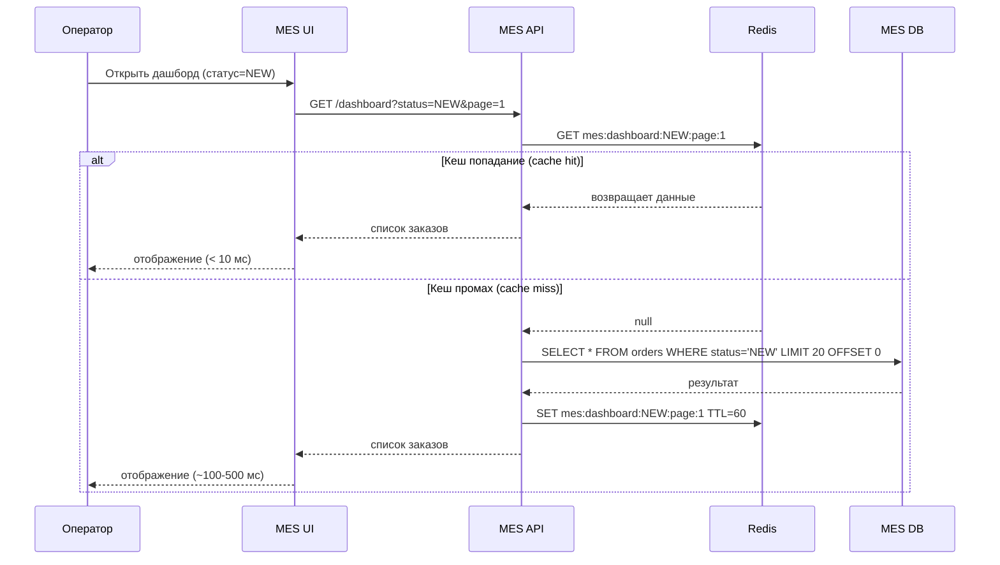
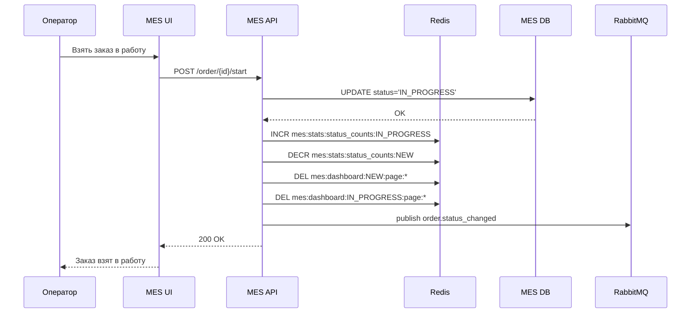
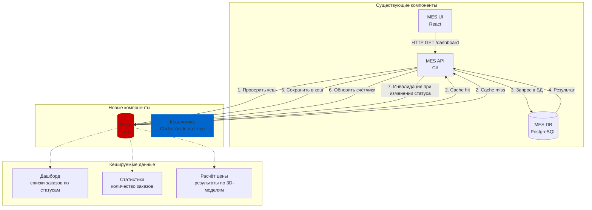

# 1. Анализ системы и выбор компонентов для кеширования
## 1.1 Проблемы, требующие решения
| Проблема | Симптом | Первопричина |
|----------|---------|--------------|
| Долгая загрузка дашборда MES | Операторы жалуются на тормоза при открытии страницы | Тяжёлые SQL-запросы (COUNT, JOIN) при каждом рендере |
| Низкая скорость выполнения заказа | Клиенты недовольны общим временем | Повторные расчёты цены для одной и той же 3D-модели |
## 1.2 Какие компоненты кешировать
| Компонент | Что кешировать | Почему |
|-----------|----------------|--------|
| MES API (дашборд) | Агрегированные списки заказов по статусам | Тяжёлые запросы к БД при каждом открытии страницы оператором |
| MES API (расчёт цены) | Результаты расчёта цены для 3D-моделей | Одна и та же модель может запрашиваться несколько раз (разными операторами или повторно) |
| MES API (статистика) | Количество заказов в каждом статусе | Постоянные COUNT-запросы для фильтров дашборда |
# 2. Мотивация: зачем компании кеширование
## 2.1 Текущая ситуация (боль)
* Операторы MES тратят 30+ секунд на загрузку дашборда вместо мгновенной работы
* Каждое открытие страницы вызывает тяжёлые SQL-запросы к MES DB (сотни тысяч записей)
* Расчёт цены для одной и той же 3D-модели может выполняться несколько раз (при повторных запросах)
* Клиенты жалуются на общее время выполнения заказа из-за долгого расчёта цены

**Бизнес-результат: падение производительности операторов, недовольство клиентов, риск потери заказов.**
## 2.2 Что даст внедрение кеширования
| Роль | Что получает |
|------|--------------|
| Операторы MES | Мгновенная загрузка дашборда (< 1 сек вместо 30 сек) |
| Клиенты (B2C/B2B) | Ускорение расчёта цены при повторных запросах (с 30 минут до < 1 секунды) |
| Разработчики | Снижение нагрузки на БД, меньше проблем с производительностью |
| Бизнес | Рост удовлетворённости клиентов и операторов |
## 2.3 Метрики успеха
| Метрика | До внедрения | После внедрения |
|---------|--------------|-----------------|
| Время загрузки дашборда MES (p95) | ~30 секунд | < 1 секунда |
| Время расчёта цены при повторном запросе | 2-30 минут | < 1 секунда |
| Нагрузка на MES DB (RPS) | 100% | снижение на 70-80% |
| Количество жалоб на тормоза | высокое | близко к 0 |
# 3. Предлагаемое решение
## 3.1 Выбор типа кеширования
| Тип | Описание | Применимость |
|-----|----------|--------------|
| Клиентское кеширование | Кеш на стороне браузера (HTTP Cache, Service Worker) | ❌ Не подходит — кеш дашборда индивидуален для каждого оператора, инвалидация сложна |
| Серверное кеширование | Кеш на стороне MES API (Redis) | ✅ Подходит — централизованное управление, инвалидация по событиям |
**Вывод: используем серверное кеширование с Redis.**
## 3.2 Выбор паттерна кеширования
| Паттерн | Описание | Почему выбран / не выбран |
|---------|----------|---------------------------|
| Cache-Aside | Приложение сначала проверяет кеш, при промахе загружает из БД и сохраняет в кеш | ✅ Выбран — простой, полный контроль, подходит для read-heavy сценариев |
| Write-Through | Запись одновременно в БД и кеш | ❌ Не подходит — дашборд только на чтение, усложняет запись |
| Refresh-Ahead | Асинхронное обновление кеша до истечения TTL | ⚠️ Избыточно для MVP — можно добавить позже при высоких нагрузках |
## 3.3 Стратегия инвалидации кеша
| Тип кеша | Стратегия | Обоснование |
|----------|-----------|-------------|
| Дашборд (списки заказов) | TTL + инвалидация по событию | TTL = 1 минута как fallback. При изменении статуса заказа — программная инвалидация конкретного ключа |
| Результаты расчёта цены | TTL (30 минут) | Цена может меняться, но не чаще 1 раза в час. TTL безопасен |
| Статистика по статусам | Программная инвалидация | При каждом изменении статуса обновляем счётчик в Redis инкрементом/декрементом |
* **Почему не только TTL: данные могут устареть за 1 минуту, оператор увидит неактуальный список. Программная инвалидация обеспечивает актуальность.**
* **Почему не только программная: при сбоях (падение Redis, баги) TTL — fallback, который очистит кеш автоматически.**
## 3.4 Сравнение стратегий инвалидации
| Критерий | TTL (временная) | Программная (по ключу) | TTL + Программная |
|----------|-----------------|------------------------|-------------------|
| Актуальность данных | ❌ Может быть устаревшим | ✅ Всегда свежие | ✅ Всегда свежие |
| Защита от сбоев | ✅ Кеш очистится автоматически | ❌ Нет fallback | ✅ Есть fallback |
| Сложность реализации | Низкая | Средняя | Средняя |
| Нагрузка на БД | Низкая | Очень низкая | Очень низкая |
| Выбор | — | — | ✅ Итоговый |
## 3.5 Структура ключей Redis
| Тип данных | Шаблон ключа | TTL | Значение                            |
|------------|--------------|-----|-------------------------------------|
| Дашборд по статусу | mes:dashboard:{status}:page:{page} | 1 мин | JSON-массив заказов                 |
| Статистика | mes:stats:status_counts | бесконечно | {"NEW": 42, "IN_PROGRESS": 128}     |
| Расчёт цены | mes:price:hash:{md5(model+material)} | 30 мин | {"price": 12500, "currency": "RUR"} |
## 3.6 Диаграмма последовательности (чтение дашборда)

## 3.7 Диаграмма последовательности (обновление статуса — инвалидация)

## 3.8 Компоненты кеширования (что нужно внедрить или доработать)

## 4. Компромиссы (trade-offs)
| Компромисс | Почему приняли | Что теряем | Как митигируем |
|------------|----------------|------------|----------------|
| TTL 1 минута для дашборда | Простота, fallback при сбоях | Данные могут быть устаревшими до 1 минуты | Программная инвалидация при изменении статуса |
| Кеш расчёта цены — 30 минут | Цена меняется редко | При изменении цены клиент получит старую | При обновлении прайса — программная очистка |
| Redis in-memory | Максимальная скорость | Потеря кеша при рестарте | Репликация, персистентность (RDB/AOF) |
| Cache-Aside паттерн | Простота, полный контроль | Первый запрос после промаха медленный | Прогрев кеша при старте (опционально) |
# 5. Результат внедрения
| Проблема | Как кеширование помогает |
|----------|--------------------------|
| Проблема 2 (тормозит дашборд MES) | Кеш дашборда: загрузка < 1 секунды вместо 30 секунд |
| Долгий расчёт цены при повторных запросах | Кеш расчёта: ответ за миллисекунды вместо 30 минут |
| Высокая нагрузка на БД | Снижение read-запросов к БД на 70-80% |
# Ключевые метрики успеха
| Метрика | Целевое значение |
|---------|------------------|
| Время загрузки дашборда MES (p95) | < 1 секунда |
| Cache hit ratio для дашборда | > 80% |
| Cache hit ratio для расчёта цены | > 50% |
| Снижение нагрузки на БД | > 70% |
